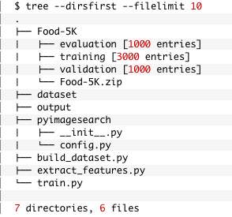
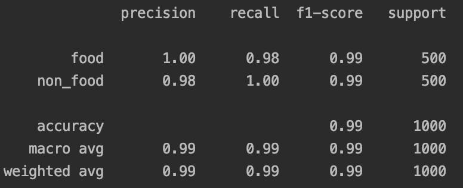

# Transfer_Learning

Using Transfer learning we can utilize an existing pre-trained classifier as a starting point for a new classification, objection dection or instance segmentation task.

In general, there are two types of transfer learning when applied to deep learning for computer vision:

1) Treating networks as arbitrary feature extractors
2  Removing the fully-connected layers of an existing network, placing a new set of FC layers on top of the CNN, and then fine-tuning these weights (and optionally previous layers) to recognize the new object classes.

For this project we will be using the 1) process and will be using VGG16 network by Simonyan and Zisserman which can be accessed via Keras.

## Ojective of Project
Yelp has just launched a new feature on its website that allows reviewers to take photos of their food/dishes and then associate them with particular items on a restaurant’s menu. Certain nefarious users aren’t taking photos of their dishes…instead, they are taking photos of themselves.
Our goal here is to figure out how to create an automated computer vision application that can distinguish between “food” and “not food”, thereby allowing Yelp to continue with their new feature launch and provide value to their users.

## DataSet
Food-5k - (5000 images labels food/not-food)

## Steps to accomplishing task
1) Creating a configuration file.
2) Building our dataset (i.e., putting the images in the proper directory structure).
3) Extracting features from our input images using Keras and pre-trained CNNs.
4) Training a Linear SVM model on top of the extracted features.

## Project Structure

## Results
This is the results obtained on the test set of 1000 images by using a Linear SVM model on top of the extracted features. Keep in mind that VGG16 was not trained to recognize the “food” versus “non-food” classes. Instead, it was trained to recognize 1,000 ImageNet classes.

